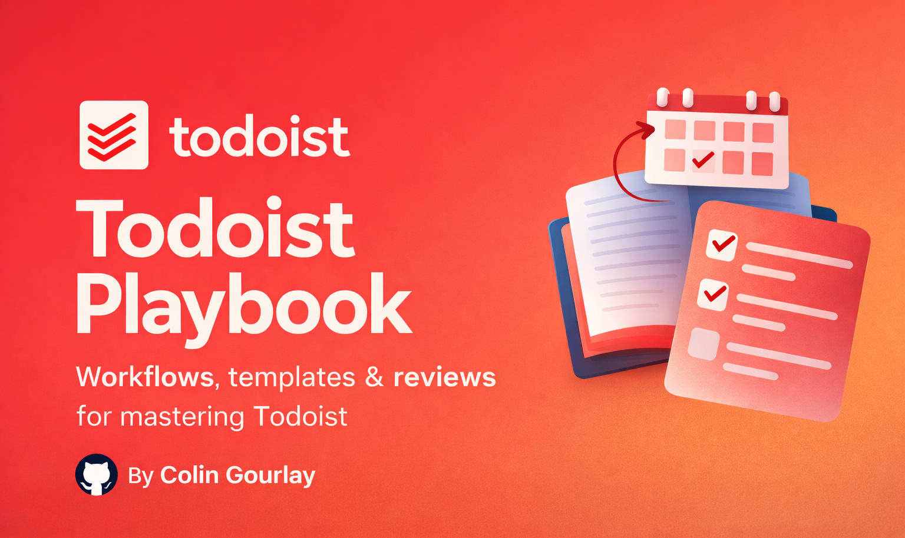
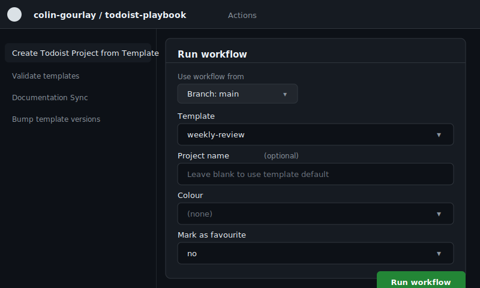
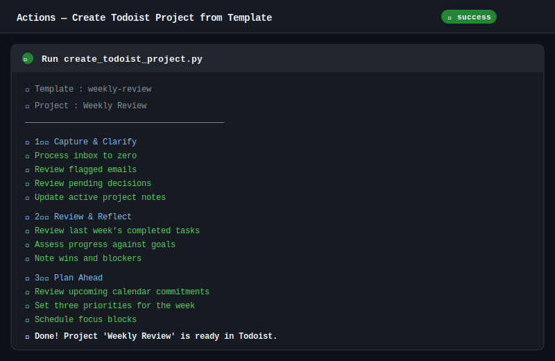
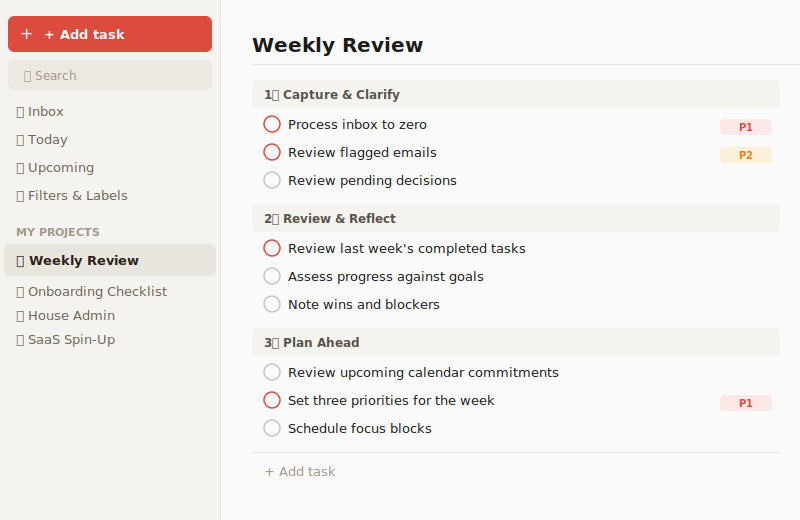

# Screenshots

This page provides a visual walkthrough of the key workflows and components in the Todoist Playbook.

---

## Social Preview



---

## GitHub Actions — Create Todoist Project from Template

The primary entry point for the automated workflow. Navigate to **Actions → Create Todoist Project from Template → Run workflow** to see the input form.

### Workflow inputs



The `workflow_dispatch` form presents the following inputs:

- **Template** — select from the dropdown (e.g. `weekly-review`, `daily-review`, `onboarding-checklist`)
- **Project name** — optional override; leave blank to use the template's default name
- **Colour** — optional project colour
- **Mark as favourite** — pin the new project in the Todoist sidebar

### Actions log output



After clicking **Run workflow**, the Actions log shows live creation progress — each section and task as it is added to Todoist.

---

## Todoist — Project result

After the workflow completes, the project appears immediately in Todoist with all sections and tasks pre-populated:



The project is structured exactly as defined in the template: named sections with tasks underneath, priority flags already applied, and subtasks nested under their parent tasks.

---

## GitHub Actions — Template Validation (CI)

Every push to `main` and every pull request triggers the **Validate templates** workflow. A passing run looks like:

```
🔎 Checking awesome-list-submission
🔎 Checking azure-migration-assessment
🔎 Checking code-review
🔎 Checking code-review-checklist
...
✅ All CSV templates validated successfully
✅ All prompt templates validated successfully
```

A failing run produces targeted error messages:

```
🔎 Checking my-new-template
❌ meta.yml missing key: description: in csv-templates/my-new-template/
❌ README.md does not contain import instructions in csv-templates/my-new-template/
💥 Validation failed
```

---

## Template Catalogue (`index.md`)

The `index.md` file is the human-readable catalogue of all available templates, organised by category:

```markdown
## 🔁 Daily & Weekly Systems

| Template     | Description                                              | Tags                              |
|-------------|----------------------------------------------------------|-----------------------------------|
| Daily Review | GTD-aligned daily review to capture, clarify, close out  | review, planning, productivity... |
| Weekly Review| Structured weekly reset to close loops and plan ahead    | review, planning, productivity... |

## 💻 Work Projects

| Template               | Description                                        | Tags                       |
|------------------------|----------------------------------------------------|----------------------------|
| Code Review Checklist  | Thorough code review checklist for any language    | code-review, quality...    |
| Iteration 0            | Sprint 0 checklist for new project setup           | sprint, azure-devops...    |
```

---

## Template Gallery (GitHub Pages)

The **Deploy Template Gallery** workflow builds a searchable static HTML gallery from all templates and deploys it to GitHub Pages. The gallery presents each template with:

- Name and description
- Category and tags
- A link to the template folder

---

## Template Folder Structure

Each CSV template lives in a `csv-templates/{slug}/` folder:

```
csv-templates/weekly-review/
├── template.csv     ← importable task list
├── meta.yml         ← machine-readable metadata
└── README.md        ← explanation and usage guide
```

### Example `meta.yml`

```yaml
name: Weekly Review
slug: weekly-review
description: Structured weekly reset to close loops and plan the week ahead
category: productivity
tags:
  - review
  - planning
  - productivity
  - weekly
version: 0.1.0
project_color: blue
```

### Example `template.csv` (first few rows)

```
TYPE,CONTENT,PRIORITY,INDENT,AUTHOR,RESPONSIBLE,DUE_DATE,DUE_DATE_LANG
section,1️⃣ Capture & Clarify,,,,,,
task,Process inbox to zero,1,1,,,,,
task,Review flagged emails,2,1,,,,,
section,2️⃣ Review & Reflect,,,,,,
task,Review last week's completed tasks,2,1,,,,,
```

---

## Bump Template Versions

When a pull request modifies a reviewed template (version ≥ `0.1.0`), the **Bump template versions** workflow automatically increments the patch version and commits back to the PR branch:

```
Detected changes in: csv-templates/weekly-review
Current version: 0.1.4
Bumped to: 0.1.5
Committed version bump for weekly-review
```

---

## Documentation Sync

The **Documentation Sync** workflow runs daily from the compiled `.github/workflows/doc-sync.lock.yml` workflow generated from `.github/workflows/doc-sync.md`. When it detects that `index.md` or a template README is out of date with recent changes, it opens a pull request automatically:

```
Branch:  doc-sync/automated-updates
Title:   docs: automated documentation sync
Changes:
  - index.md      (updated catalogue entry)
  - CHANGELOG.md  (added unreleased entry)
```
